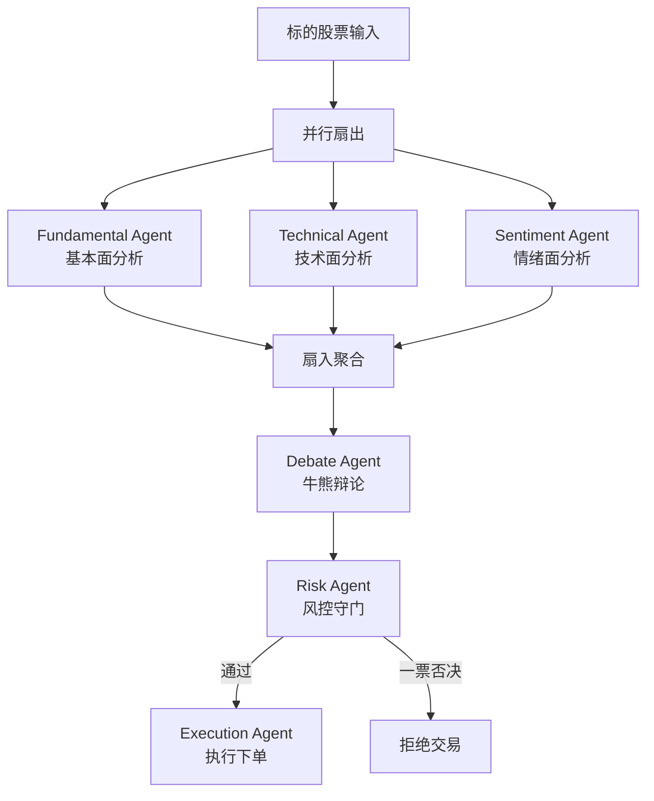

# 多Agent量化交易与投资决策系统 - 面试级项目全攻略

## 一、项目定位与参考

基于调研，参考以下企业级开源项目：
- **TradingAgents** (TauricResearch, 45k+ stars) - 多Agent金融交易框架，含分析师团队 + 牛熊辩论 + 风控
- **AlphaLoop** - RL + 多Agent交易系统，基于LangGraph
- **FinRobot** (AI4Finance) - 金融多Agent平台
- **AgentEnsemble** (Java 21多Agent框架) - 支持并行/层级/MapReduce
- **Google ADK Java** - Google官方Agent开发工具包
- **Lango** (Go语言Agent运行时)

框架选型：**LangGraph**（Python主力），性能最优、生产就绪、支持状态持久化和检查点。

## 二、项目架构设计



## 三、仓库结构规划

```
multi-agent-trading-system/
├── README.md                          # 超详细README（中英文）
├── plan.md                            # 项目计划文档
├── docs/
│   ├── architecture.md                # 架构设计详解
│   ├── interview-guide.md             # 面试全攻略（八股文+STAR法）
│   ├── resume-template.md             # 简历写法模板
│   └── agent-design-patterns.md       # Agent设计模式详解
│
├── python/                            # Python实现（LangGraph）
│   ├── README.md
│   ├── requirements.txt
│   ├── config/
│   │   └── settings.py
│   ├── agents/
│   │   ├── fundamental_agent.py       # 基本面Agent
│   │   ├── technical_agent.py         # 技术面Agent
│   │   ├── sentiment_agent.py         # 情绪Agent
│   │   ├── debate_agent.py            # 辩论Agent
│   │   ├── risk_agent.py              # 风控Agent
│   │   └── execution_agent.py         # 执行Agent
│   ├── graph/
│   │   └── trading_graph.py           # LangGraph编排
│   ├── tools/
│   │   ├── market_data.py             # yfinance数据
│   │   ├── technical_indicators.py    # 技术指标计算
│   │   └── sentiment_tools.py         # 情绪分析工具
│   ├── backtest/
│   │   └── backtester.py              # 回测引擎
│   └── tests/
│
├── java/                              # Java实现（AgentEnsemble/Spring AI）
│   ├── README.md
│   ├── pom.xml
│   └── src/main/java/...
│
├── golang/                            # Go实现
│   ├── README.md
│   ├── go.mod
│   └── cmd/...
│
└── .env.example                       # 环境变量模板（不含真实密钥）
```

## 四、各语言实现要点

### Python（主力，最详细）
- **框架**: LangGraph + LangChain
- **数据源**: yfinance（免费）、SEC EDGAR
- **技术指标**: ta-lib / pandas_ta
- **回测**: 自建回测引擎，计算 Sharpe/MaxDrawdown/年化收益
- **核心亮点**: 
  - `Send()` 实现动态并行 fan-out
  - `Annotated[list, add]` reducer 合并并行结果
  - Bull/Bear辩论用结构化 prompt 对抗
  - Risk Agent 硬规则 + LLM 判断双层门控

### Java（企业级风格）
- **框架**: AgentEnsemble（Java 21）或 Spring AI + Google ADK
- **特点**: Virtual Thread并行、Maven构建、强类型Agent接口
- **适合**: 面试Java后端/金融科技岗位

### Go（高性能风格）
- **框架**: 自建 goroutine + channel 编排
- **特点**: 展示并发编程能力、轻量Agent接口
- **适合**: 面试基础设施/高频交易岗位

## 五、文档体系（面向小白）

### 5.1 README.md 超详细内容
- 项目介绍与动机
- 架构图（mermaid）
- 快速开始（3步跑起来）
- 每个Agent的职责详解（带代码片段）
- 三语言实现对比表
- 回测结果展示（表格+图表）
- 面试相关文档索引

### 5.2 面试全攻略 (interview-guide.md)
- **八股文题库**（30+题）：
  - 多Agent编排模式（并行/串行/层级/辩论）
  - LangGraph状态管理与检查点
  - Fan-out/Fan-in实现原理
  - 风控Agent一票否决设计
  - 回测指标（Sharpe/MaxDrawdown/VaR）
  - Agent间通信模式
  - 生产环境Agent可观测性
  
- **STAR法话术模板**：
  - S: 公司需要自动化投资决策系统
  - T: 我负责设计6-Agent并行+辩论架构
  - A: 实现并行分析、牛熊辩论、风控守门三层机制
  - R: 回测年化13.4%，夏普1.8，回撤控制8%以内

- **面试高频追问及应答**：
  - "为什么用6个Agent而不是1个大模型？"
  - "辩论机制如何避免死循环？"
  - "风控Agent的否决逻辑是确定性的还是LLM判断？"
  - "如何保证Agent间数据一致性？"
  - "生产环境如何监控Agent故障？"

### 5.3 简历模板 (resume-template.md)
- 针对不同岗位的简历写法（AI工程师/后端/量化）
- 量化指标提炼技巧

## 六、安全注意事项
- 所有API密钥使用环境变量，提供 `.env.example`
- `.gitignore` 排除所有敏感文件
- README中提醒用户配置自己的密钥
